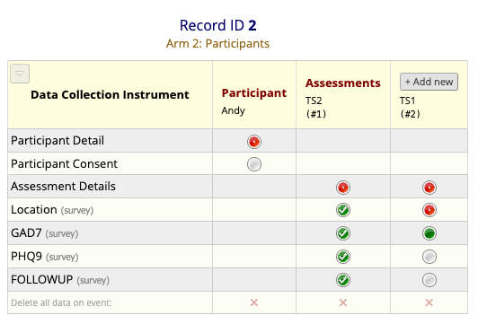
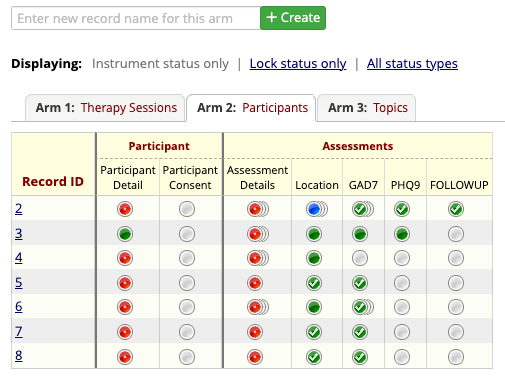
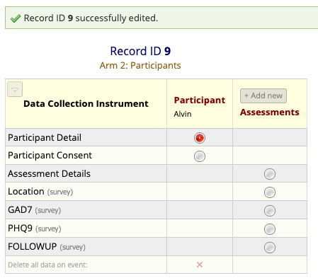
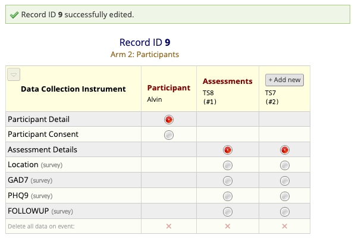
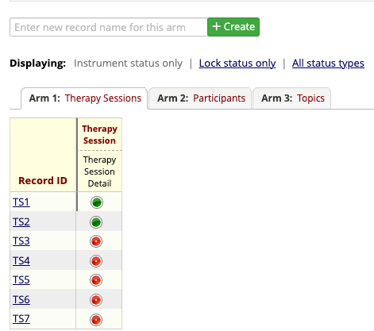
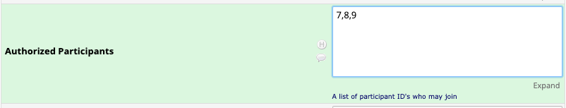
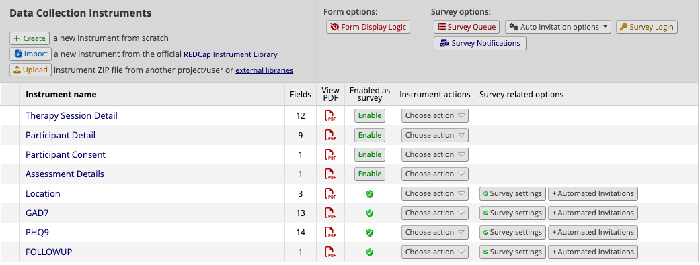

External module that allows patients to communicate with physicians in a chat room style HIPAA compliant application.

# Building UI
-  Ui is built using react and must be prebuilt before pushing to production
-  **npm run build** will transpile the code using vite
-  For hot reloading, **npm run dev** will start the development server

# Project setup
- This project requires extensive setup to work properly, please follow all of the instructions closely.

## Arm 1 - Therapy sessions
Therapy sessions will house all the information pertaining to a given chat room session.
These will need to be created beforehand manually.
### Fields
- **Session Topic**
  - Topic of the session. This description will be displayed to participants on the selection page after login.
- **Session Title**
  - General description of the session. This title will also be displayed to participants on the selection page after login
- **Session Start**
  - Scheduled start time of therapy session. [Metadata]
- **Therapist ID**
  - Record ID of the main therapist overseeing the given therapy session.
  - **Example:** 2
- **Session Whiteboard**
  - Whiteboard information is displayed to all participants during a chat session. Stored as a text field that can be updated
- **Authorized Participants**
  - Participant's record ID's should be placed in this field as a comma delimited list
  - **Example:** 4,2,3
- **In Chat Room Participants**
  - Participants record ID's matching users that have been admitted to the therapy session by an administrator
  - Also a comma delimited list
- **Finished Participants**
  - Participants record ID's matching users that have finished chatting in a given therapy session
  - This includes all individuals in the session at the time an administrator clicks the end session button
- **Pre session Surveys**
  - A comma delimited list of survey names (case insensitive) that are required to be completed before a participant can enter the chat session
  - **Example:** GAD7, PHQ9, location
- **Post session Surveys**
  - A comma delimited list of survey names (case insensitive) that are shown to the user after finishing a chat session

## Arm 2 - Participants
Arm two contains two events, Participant and Assessments
### Participant Fields (Participant Detail)
- **Display Name**
  - User's name visible to chatting participants in a group session
- **Phone Number**
  - Participants phone number used to receive SMS code for login
- **Participant OTP Code**
  - SMS code that will get sent to the users cell # for login
  - This should be read only and will refresh each time a user attempt to login (expires in 30m)
- **Admin**
  - Whether or not the user is an administrator.
  - Influences viewership, roles for chatting
### Assessment Fields (Participant Detail)
- **Assessment Therapy Session ID**
  - This field is a linking field used to indicate which repeating set of events (assessment groups) correspond to a given therapy session
  - For each therapy session a user is listed as a participant in, whether **In Chat Room** or **Authorized Participants**
a corresponding **Particpant detail** instrument must be completed with the matching therapy session record id
- Each new assessment should be added as an instrument to the assessment event
- Each therapy session a participant attends will be represented as a repeating event

- The following image shows a basic configuation example:

- Note the TS2 and TS1 assessments here. Assessments can be in any order in the participants arm
- In this case, TS2 and TS1 will have the record id **2** in the list of integers **ts_authorized_participants**

# Step by step guide
## Creating a new user

1. Create a new record name. Generally it's easiest if we remain consistent, so in this case we'll use **9**
2. Fill out the Participant Detail record using the field descriptions above for reference
3. Click the hyperlink for the newly created record id

4. Fill out Assessment Details with the Therapy Session ID the participant will take part in
5. If the participant will be part of more than one Therapy Session, Click Add new and fill out an Assessment Details record for each session

## Creating a new therapy session

1. Create a new record name: Record ID **TS8**
2. Fill out the information on the record using the field descriptions above for reference
3. In the **Authorized Participants** field, list the participant id 9 in the comma delimited list

## Adding surveys to therapy sessions
1. Navigate to the online designer and create a new instrument
2. Enable the instrument as a survey
3. Click on survey settings and set the **Redirect to URL** field to either:
   - For redirecting back to the landing page (pre-chat surveys)
     - https://redcap.stanford.edu/redcap_v13.10.4/ExternalModules/?prefix=group_therapy_sms&page=pages%2Froot&pid=29380#/landing
   - For redirecting back to the completed page (post-chat surveys)
     - https://redcap.stanford.edu/redcap_v13.10.4/ExternalModules/?prefix=group_therapy_sms&page=pages%2Froot&pid=29380#/completed

4. Navigate back to project setup
5. Click on **Designate instruments for my events**
6. Under **Arm 2 - Participants**, check the box in the Assessments column corresponding to the newly created survey
